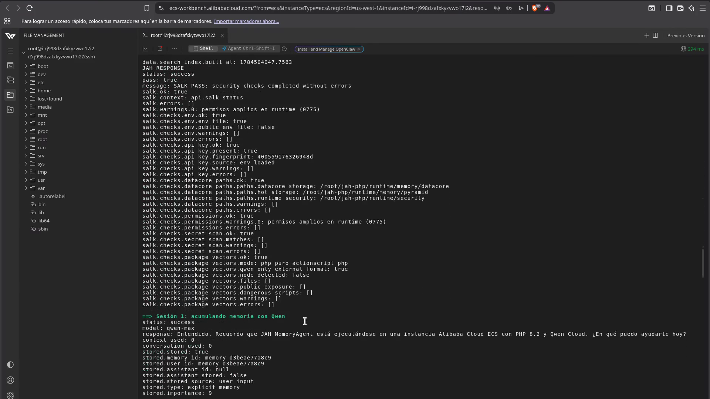

# Alibaba Cloud Deployment Proof

This document identifies the repository code link used as Alibaba Cloud proof and provides a deployment verification checklist.

## Repository evidence

The official runtime connects to Qwen Cloud through:

- [`app/QwenConnector.php`](app/QwenConnector.php): native PHP cURL request to the Qwen Cloud compatible API.
- [`app/actions/MemoryActionScript.php`](app/actions/MemoryActionScript.php): `qwen.ask` ActionScript action and memory workflow.
- [`app/config/qwen.php`](app/config/qwen.php): environment-driven Qwen model and endpoint configuration.
- [`app/security/SalkGuard.php`](app/security/SalkGuard.php): key protection, masking, preflight, and audit.

The Qwen API key is loaded from the environment and is sent only in the HTTP `Authorization` header. It is never included in the request body, memory records, public output, or repository.

## Deployment evidence status

| Evidence | Status |
|---|---|
| Qwen Cloud integration code | Complete |
| Alibaba Cloud backend resource | Complete — deployed on Alibaba Cloud ECS |
| Public endpoint | Complete — [http://47.77.201.239:8000/index.php](http://47.77.201.239:8000/index.php) |
| Access control | Complete — protected with temporary `JAH_API_KEY` login; judge key shared privately |
| Public source repository | Complete — [github.com/esmeydub/jah-php](https://github.com/esmeydub/jah-php) |
| Public Alibaba Cloud proof document | Complete — this document and the deployment screenshot below |
| Required Alibaba service/API code link | Complete — [`app/QwenConnector.php`](app/QwenConnector.php) |
| Reproducible ECS installer | Complete — [`deploy_alibaba_ecs.sh`](deploy_alibaba_ecs.sh) |

The deployment was verified on Alibaba Cloud Linux 3 (OpenAnolis Edition), x86-64, with PHP 8.2.32. The `jah-memoryagent.service` unit was active and enabled, the application listened on port 8000, and the deployment report recorded `SUMMARY 18/18` for the product suite and `SUMMARY 7/7` for the ActionScript suite. The verified source revision was `e9c094cf1a40111196bbb6e09610722be4a7ffcd`.



## Automated ECS deployment

On a clean Alibaba Cloud Linux 3 ECS instance, install Git, clone the public repository, and run the installer as root:

```bash
dnf install -y git
cd /root
git clone https://github.com/esmeydub/jah-php.git
cd /root/jah-php
chmod 755 deploy_alibaba_ecs.sh
./deploy_alibaba_ecs.sh
```

The installer requests `QWEN_API_KEY` and `JAH_API_KEY` using hidden terminal input. The values are written only to the ignored `.env`; they are never embedded in the script, printed to the terminal, or committed to Git. The installer then installs PHP 8.2, validates the source, runs the 18/18 product suite and 7/7 ActionScript suite, starts `jah-memoryagent.service`, performs live Qwen and cross-session memory checks, and creates `runtime/deployment/alibaba-ecs-proof.txt`.

Verify the finished deployment on ECS:

```bash
systemctl status jah-memoryagent --no-pager -l
ss -ltnp | grep ':8000'
cat /root/jah-php/runtime/deployment/alibaba-ecs-proof.txt
```

## Current public judging access

The judging deployment is currently available directly from the Alibaba Cloud ECS public IP:

```text
http://47.77.201.239:8000/index.php
```

Inbound TCP 8000 is temporarily authorized in the ECS Security Group for hackathon evaluation. The application remains protected by the server-side `JAH_API_KEY` login. The temporary judge key is shared only in Devpost's private testing instructions; it is not stored in this repository or exposed in the demo video. `QWEN_API_KEY` remains server-side at all times.

The current request path is:

```text
Judge browser -> ECS public IP:8000 -> JAH_API_KEY login
  -> jah-memoryagent.service -> Qwen Cloud over outbound HTTPS
```

After the judging period, the public port rule should be removed and the temporary judge key rotated.

## Historical private validation through an SSH tunnel

Before public judging access was enabled, the deployment was tested without opening inbound TCP 8000. An SSH local-forward was used from the authorized workstation:

From the authorized test workstation, start local port forwarding:

```bash
ssh -N -L 8000:127.0.0.1:8000 root@ECS_PUBLIC_IP
```

Then open:

```text
http://127.0.0.1:8000/index.php
```

The historical test path was:

```text
Browser 127.0.0.1:8000
  -> encrypted SSH local-forward channel over TCP 22
  -> ECS 127.0.0.1:8000
  -> jah-memoryagent.service
  -> Qwen Cloud over outbound HTTPS
```

`-N` tells SSH not to open a remote shell. `-L 8000:127.0.0.1:8000` maps port 8000 on the tester's own computer to port 8000 on the ECS loopback interface. This tunnel was used only for private deployment validation and video recording; it is not the current judge access method. The SSH password or private key and both application API keys remain outside the repository and video.

## Deployment verification checklist

Verify all of the following without exposing credentials:

1. The Alibaba Cloud console and the backend compute resource used by JAH MemoryAgent.
2. The resource name, region, running state, and SSH access path.
3. The deployed repository revision or application directory.
4. The running PHP service or process.
5. A request to `api.php?action=status` returning `JAH_RESPONSE`.
6. A live POST request to the MemoryAgent chat action.
7. The corresponding backend log or ActionScript trace showing Qwen inference completed.
8. The Qwen API key remains fully hidden.

## Suggested verification commands

Run these on the Alibaba Cloud backend:

```bash
php -v
php -m | grep -E 'curl|zlib'
php tests/run.php
php php_actionscript_php_doc/tests/run.php
```

Verify the current public deployment from a client with the temporary judge key:

```bash
PUBLIC_ENDPOINT='http://47.77.201.239:8000'
curl -H "X-JAH-API-Key: $JAH_API_KEY" \
  "$PUBLIC_ENDPOINT/api.php?action=status"
```

Verify Qwen and persistent memory:

```bash
curl -X POST \
  -H "X-JAH-API-Key: $JAH_API_KEY" \
  -d "action=chat" \
  -d "collection=deployment-proof" \
  -d "message=Remember that this backend is deployed on Alibaba Cloud" \
  "$PUBLIC_ENDPOINT/api.php"
```

## Submission links

- Public source repository: [https://github.com/esmeydub/jah-php](https://github.com/esmeydub/jah-php)
- Public Alibaba Cloud proof: [ALIBABA_CLOUD_PROOF.md](ALIBABA_CLOUD_PROOF.md)
- Alibaba Cloud/Qwen service code: [app/QwenConnector.php](app/QwenConnector.php)
- Automated ECS installer: [deploy_alibaba_ecs.sh](deploy_alibaba_ecs.sh)
- Architecture diagram: [docs/submission/jah-memoryagent-architecture-en.png](docs/submission/jah-memoryagent-architecture-en.png)
- Deployment screenshot: [docs/submission/alibaba-ecs-deployment-proof.png](docs/submission/alibaba-ecs-deployment-proof.png)
- Public demonstration video: [https://youtu.be/3H8MfxC-SFY](https://youtu.be/3H8MfxC-SFY)

The required public video link is the approximately three-minute demo listed in [`README.md`](README.md).
